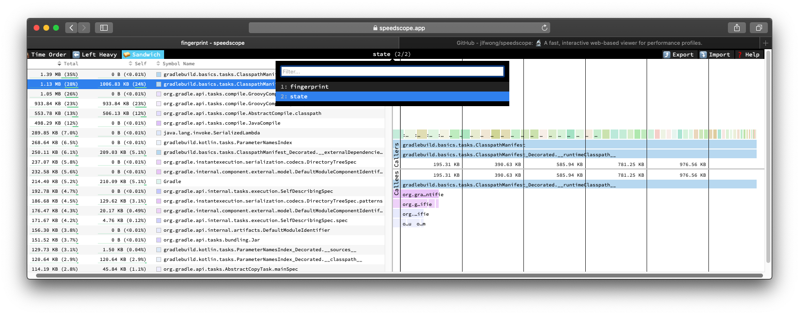

# Gradle Configuration Cache Log To Speedscope

Space usage analysis for [Gradle configuration cache](https://docs.gradle.org/current/userguide/configuration_cache.html)
files via [speedscope](https://speedscope.app).

## Installing

Build and install with Gradle:

    ./gradlew install

Setup an alias:

    alias gcc2ss=$(pwd)/build/install/gcc2speedscope/bin/gcc2speedscope

## Using

Produce a speedscope document from a Gradle debug log file:

    $ gcc2ss ~/my/debug.log >> speedscope.json

Produce a speedscope document from a Gradle build:

    $ ./gradlew assemble --configuration-cache -d | gcc2ss -- >> speedscope.json

### Dealing with information overload

Some larger builds might generate too much information. This can be more than
what speedscope can currently handle.

You might also want to focus the space usage report on a subset of objects for
quicker iterations.

For those scenarios, `gcc2ss` allows the space usage events to be filtered via a
regular expression provided in the `GCC2SS_INCLUDE` environment variable.

Only objects whose name match the provided pattern fully will be included in the
final document. The term `object` is being used loosely to mean any named
delimited piece of information (i.e. `frame`) stored to the cache, for example:
* Gradle task instance frames are named with the task absolute path
* Java type frames are named with the full class name of the stored object
* Java type field frames are named `${qualifiedClassName}.${fieldName}`

For a comprehensive and up-to-date list of possible `frame` names, check the
call hierarchy of
[`withDebugFrame`](https://github.com/gradle/gradle/blob/5b5514c90d99f506f77d0b789b5d38dcf4bafd57/platforms/core-configuration/configuration-cache/src/main/kotlin/org/gradle/configurationcache/serialization/Logging.kt#L128)
in the Gradle codebase.

For instance, to quickly gain an understanding of which tasks are occupying more
space (task names always start with `:`), the following command line would work:

    $ GCC2SS_INCLUDE=":.+" gcc2ss ~/my/debug.log >> tasks.json
